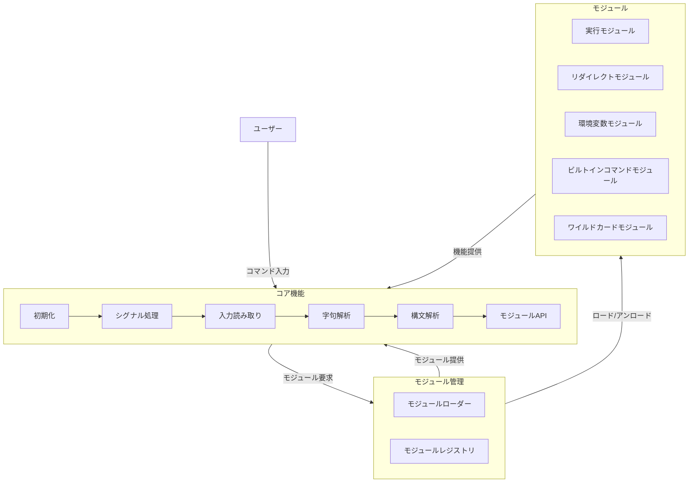
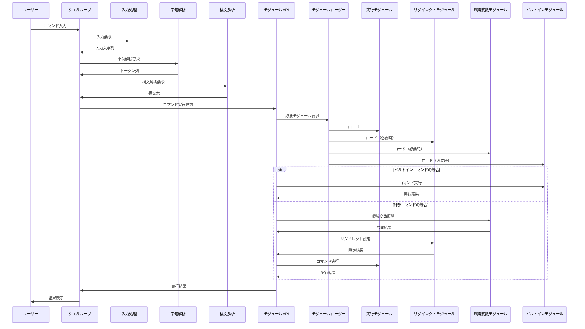

# モジュラー Minishell 設計書

## 概要

このドキュメントでは、42の課題であるminishellを独自のモジュール機構を備えた設計で実装する方法について詳細に説明します。この設計の主な目的は、コア処理機構とモジュールによる処理を明確に分離し、将来的にSQLサーバーなどの対話型コントローラに移植可能な構造を提供することです。

## 設計原則

1. **コア/モジュール分離**: シェルの基本機能（シグナル処理、入力解析、シェルループ）をコアとして実装し、実行、リダイレクト、環境変数、ビルトインコマンドなどをモジュールとして実装
2. **プラグイン機構**: モジュールの着脱をフラグで管理し、必要なモジュールのみを動的に利用可能
3. **最小依存性**: モジュール間の依存関係を最小限に抑え、独立して機能するよう設計
4. **標準インターフェース**: すべてのモジュールが従う統一されたAPIを定義
5. **軽量設計**: 最小限のリソース使用で効率的な動作を実現

## システムアーキテクチャ



## データフロー



## コアコンポーネント

### 1. シェルループ (shell_loop)

シェルの中心となるループ処理を担当し、以下の機能を提供します：

- ユーザー入力の受け付け
- 字句解析・構文解析の呼び出し
- モジュールAPIを通じたコマンド実行
- シグナル処理の統合
- 終了処理

```c
// シェルループの簡略化された実装
void shell_loop(t_shell *shell, const char *prompt)
{
    while (1)
    {
        // 各ループの初期化
        line_init(shell);
        
        // 入力受付
        shell->source_line = launch_readline(prompt);
        if (shell->source_line == NULL)
            shell_exit(shell, shell->status);
            
        // シグナル処理
        if (g_signal_status == SIGINT)
        {
            g_signal_status = 0;
            free(shell->source_line);
            shell->source_line = NULL;
            continue;
        }
        
        // 解析と実行
        int status = launch_lexer(shell) || launch_parser(shell) || launch_executor(shell);
        if (status != E_NONE)
            shell_exit(shell, status);
    }
}
```

### 2. シグナル処理 (signal)

シェルのシグナル処理を担当し、以下のシグナルに対応します：

- `SIGINT` (Ctrl+C): プロンプトを再表示
- `SIGQUIT` (Ctrl+\): 何もしない
- `EOF` (Ctrl+D): シェルを終了

```c
// シグナル初期化
int init_signals(void)
{
    struct sigaction sa_int;
    struct sigaction sa_quit;

    sa_int.sa_handler = sigint_handler;
    sa_int.sa_flags = SA_RESTART;
    sigemptyset(&sa_int.sa_mask);
    if (sigaction(SIGINT, &sa_int, NULL) == -1)
        return (-1);
        
    sa_quit.sa_handler = sigquit_handler;
    sa_quit.sa_flags = SA_RESTART;
    sigemptyset(&sa_quit.sa_mask);
    if (sigaction(SIGQUIT, &sa_quit, NULL) == -1)
        return (-1);
        
    return (0);
}
```

### 3. 入力処理 (readline)

ユーザー入力を処理し、以下の機能を提供します：

- readline ライブラリを使用した入力受付
- 複数行入力のサポート（クォートが閉じられていない場合など）
- 入力履歴の管理

### 4. 字句解析 (lexer)

入力文字列をトークンに分割し、以下の処理を行います：

- メタ文字の識別 (`|`, `>`, `<`, `>>`, `<<`, `&&`, `||` など)
- クォート処理（シングル/ダブルクォート）
- 環境変数のマーキング（展開はモジュールで行う）

### 5. 構文解析 (parser)

トークン列から構文木を構築し、以下の処理を行います：

- コマンド、引数、リダイレクト、パイプの構造化
- 構文エラーの検出
- 複雑なコマンド制御（`&&`, `||`, `()` など）の解析

### 6. モジュールAPI (module_api)

コアとモジュール間のインターフェースを提供し、以下の機能を実装します：

- モジュールの登録・解除
- モジュール間の通信
- モジュールの機能呼び出し

## モジュール設計

### 1. モジュールローダー (module_loader)

モジュールの動的ロード・アンロードを担当し、以下の機能を提供します：

- モジュールの初期化
- モジュールの依存関係解決
- モジュールのフラグ管理

```c
// モジュールローダーの簡略化された実装
int load_module(t_shell *shell, t_module_type type)
{
    if (shell->modules[type].loaded)
        return (0);  // 既にロード済み
        
    // 依存モジュールのロード
    for (int i = 0; i < shell->modules[type].deps_count; i++)
    {
        if (load_module(shell, shell->modules[type].deps[i]) != 0)
            return (-1);
    }
    
    // モジュール初期化関数の呼び出し
    if (shell->modules[type].init_func(shell) != 0)
        return (-1);
        
    shell->modules[type].loaded = 1;
    return (0);
}
```

### 2. 実行モジュール (executor)

コマンドの実行を担当し、以下の機能を提供します：

- 外部コマンドの実行 (`fork`, `execve`)
- パイプラインの処理
- 終了ステータスの管理

```c
// 実行モジュールのインターフェース
typedef struct s_executor_module
{
    int (*execute)(t_shell *shell, t_command *cmd);
    int (*execute_pipeline)(t_shell *shell, t_pipeline *pipeline);
    int (*wait_for_processes)(t_shell *shell);
} t_executor_module;
```

### 3. リダイレクトモジュール (redirect)

入出力のリダイレクトを担当し、以下の機能を提供します：

- 入力リダイレクト (`<`)
- 出力リダイレクト (`>`, `>>`)
- ヒアドキュメント (`<<`)
- ファイルディスクリプタの管理

```c
// リダイレクトモジュールのインターフェース
typedef struct s_redirect_module
{
    int (*setup_redirects)(t_shell *shell, t_command *cmd);
    int (*restore_redirects)(t_shell *shell);
    int (*handle_heredoc)(t_shell *shell, const char *delimiter);
} t_redirect_module;
```

### 4. 環境変数モジュール (env)

環境変数の管理を担当し、以下の機能を提供します：

- 環境変数の取得・設定・削除
- 環境変数の展開 (`$VAR`, `$?`)
- PATH検索

```c
// 環境変数モジュールのインターフェース
typedef struct s_env_module
{
    char **(*get_env)(t_shell *shell);
    char *(*get_env_value)(t_shell *shell, const char *name);
    int (*set_env)(t_shell *shell, const char *name, const char *value);
    int (*unset_env)(t_shell *shell, const char *name);
    char *(*expand_variables)(t_shell *shell, const char *str);
    char *(*find_command_path)(t_shell *shell, const char *cmd);
} t_env_module;
```

### 5. ビルトインコマンドモジュール (builtin)

シェル内部コマンドを実装し、以下のコマンドを提供します：

- `echo` (オプション `-n` のみ対応)
- `cd` (相対・絶対パスのみ)
- `pwd` (オプションなし)
- `export` (オプションなし)
- `unset` (オプションなし)
- `env` (オプションや引数なし)
- `exit` (オプションなし)

```c
// ビルトインモジュールのインターフェース
typedef struct s_builtin_module
{
    int (*is_builtin)(const char *cmd);
    int (*execute_builtin)(t_shell *shell, t_command *cmd);
    
    // 個別のビルトインコマンド
    int (*echo)(t_shell *shell, char **args);
    int (*cd)(t_shell *shell, char **args);
    int (*pwd)(t_shell *shell, char **args);
    int (*export)(t_shell *shell, char **args);
    int (*unset)(t_shell *shell, char **args);
    int (*env)(t_shell *shell, char **args);
    int (*exit_cmd)(t_shell *shell, char **args);
} t_builtin_module;
```

### 6. ワイルドカードモジュール (wildcard)

ワイルドカード展開を担当し、以下の機能を提供します：

- `*` パターンのマッチング
- ファイル名の展開
- ソート処理

```c
// ワイルドカードモジュールのインターフェース
typedef struct s_wildcard_module
{
    char **(*expand_wildcards)(t_shell *shell, const char *pattern);
    void (*free_expansions)(char **expansions);
} t_wildcard_module;
```

## モジュールAPI設計

モジュールAPIは、コアとモジュール間の標準インターフェースを定義します。

### モジュール登録

```c
// モジュール登録インターフェース
typedef struct s_module_info
{
    const char *name;           // モジュール名
    int (*init)(t_shell *shell); // 初期化関数
    int (*cleanup)(t_shell *shell); // クリーンアップ関数
    void *interface;            // モジュール固有のインターフェース
    t_module_type *dependencies; // 依存モジュール
    int dep_count;              // 依存モジュール数
    int loaded;                 // ロード状態
} t_module_info;

// モジュールタイプ
typedef enum e_module_type
{
    MODULE_EXECUTOR,
    MODULE_REDIRECT,
    MODULE_ENV,
    MODULE_BUILTIN,
    MODULE_WILDCARD,
    MODULE_COUNT  // モジュール総数
} t_module_type;

// モジュール登録関数
int register_module(t_shell *shell, t_module_type type, t_module_info *info);
```

### モジュール呼び出し

```c
// モジュール機能呼び出し
void *get_module_interface(t_shell *shell, t_module_type type);

// 使用例
t_env_module *env = (t_env_module *)get_module_interface(shell, MODULE_ENV);
if (env)
{
    char *value = env->get_env_value(shell, "HOME");
    // ...
}
```

## シェル構造体

シェル全体の状態を管理する構造体を定義します：

```c
typedef struct s_shell
{
    // コア状態
    char *source_line;          // 入力行
    t_token *tokens;            // トークン列
    t_ast *syntax_tree;         // 構文木
    int status;                 // 終了ステータス
    
    // モジュール管理
    t_module_info modules[MODULE_COUNT];  // モジュール情報
    int module_flags;           // モジュールフラグ
    
    // リソース管理
    int stdin_backup;           // 標準入力バックアップ
    int stdout_backup;          // 標準出力バックアップ
    int stderr_backup;          // 標準エラー出力バックアップ
    
    // その他
    int interactive;            // インタラクティブモード
    int exit_requested;         // 終了要求フラグ
} t_shell;
```

## モジュールフラグ管理

モジュールの有効/無効を制御するフラグを定義します：

```c
// モジュールフラグ
#define MODULE_FLAG_EXECUTOR  (1 << 0)
#define MODULE_FLAG_REDIRECT  (1 << 1)
#define MODULE_FLAG_ENV       (1 << 2)
#define MODULE_FLAG_BUILTIN   (1 << 3)
#define MODULE_FLAG_WILDCARD  (1 << 4)

// すべてのモジュールを有効化
#define MODULE_FLAG_ALL       (MODULE_FLAG_EXECUTOR | MODULE_FLAG_REDIRECT | \
                              MODULE_FLAG_ENV | MODULE_FLAG_BUILTIN | \
                              MODULE_FLAG_WILDCARD)

// モジュールフラグ操作関数
void enable_module(t_shell *shell, t_module_type type);
void disable_module(t_shell *shell, t_module_type type);
int is_module_enabled(t_shell *shell, t_module_type type);
```

## 初期化とクリーンアップ

シェルの初期化とクリーンアップを行う関数を定義します：

```c
// シェル初期化
int shell_init(t_shell *shell, char **env, int module_flags)
{
    // シェル構造体の初期化
    memset(shell, 0, sizeof(t_shell));
    shell->module_flags = module_flags;
    shell->status = 0;
    shell->interactive = isatty(STDIN_FILENO);
    
    // 標準ファイルディスクリプタのバックアップ
    shell->stdin_backup = dup(STDIN_FILENO);
    shell->stdout_backup = dup(STDOUT_FILENO);
    shell->stderr_backup = dup(STDERR_FILENO);
    
    // シグナル初期化
    if (init_signals() != 0)
        return (-1);
        
    // モジュール初期化
    if (init_modules(shell, env) != 0)
        return (-1);
        
    return (0);
}

// シェルクリーンアップ
void shell_cleanup(t_shell *shell)
{
    // モジュールのクリーンアップ
    for (int i = 0; i < MODULE_COUNT; i++)
    {
        if (shell->modules[i].loaded && shell->modules[i].cleanup)
            shell->modules[i].cleanup(shell);
    }
    
    // リソースの解放
    if (shell->source_line)
        free(shell->source_line);
    if (shell->tokens)
        free_tokens(shell->tokens);
    if (shell->syntax_tree)
        free_ast(shell->syntax_tree);
        
    // ファイルディスクリプタのクローズ
    close(shell->stdin_backup);
    close(shell->stdout_backup);
    close(shell->stderr_backup);
}
```

## 実装方針

1. **段階的開発**:
   - コア機能を最初に実装
   - 各モジュールを独立して開発
   - モジュールAPIを介して統合

2. **テスト戦略**:
   - 各モジュールの単体テスト
   - モジュール間の統合テスト
   - シェル全体の機能テスト

3. **拡張性**:
   - 新しいモジュールの追加が容易な設計
   - 既存モジュールの機能拡張が可能
   - 異なる対話型アプリケーションへの移植性

## 移植性と再利用性

この設計の主な利点は、コア部分とモジュールの明確な分離により、SQLサーバーなどの他の対話型アプリケーションに容易に移植できる点です：

1. **コア再利用**:
   - 入力処理
   - シグナル処理
   - 基本的な解析機能

2. **モジュール置換**:
   - シェル固有のモジュール（executer, builtinなど）をSQLモジュールに置き換え
   - 共通モジュール（env, redirectなど）は再利用可能

3. **拡張例**:
   - SQLサーバー: SQL解析モジュール、データベース接続モジュールを追加
   - デバッガー: ブレークポイント管理モジュール、変数監視モジュールを追加

## 結論

この設計は、42のminishell課題の要件を満たしつつ、モジュール性と再利用性を重視した実装を提供します。コアとモジュールの明確な分離により、将来的な拡張や他のプロジェクトへの移植が容易になります。また、モジュールのフラグ管理により、必要な機能のみを有効化することで、軽量かつ効率的な動作を実現します。
