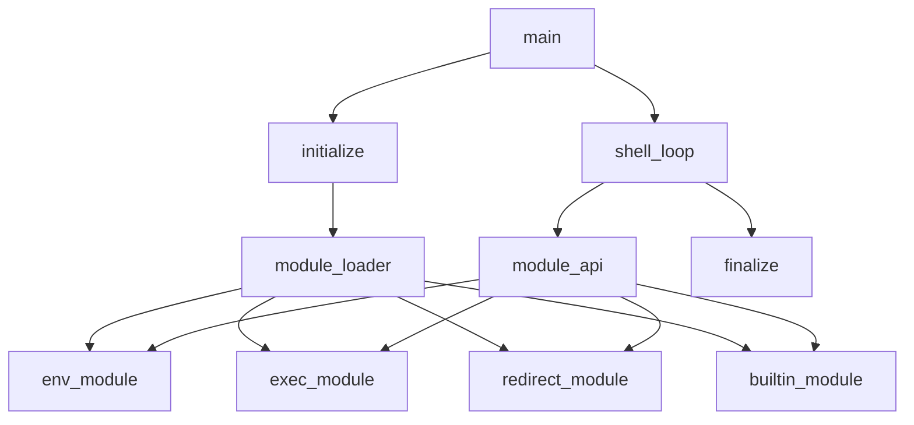
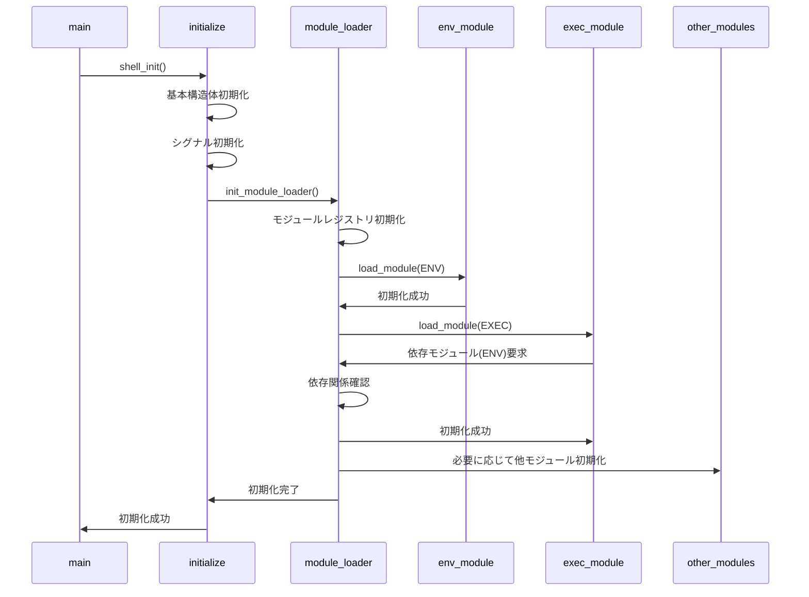
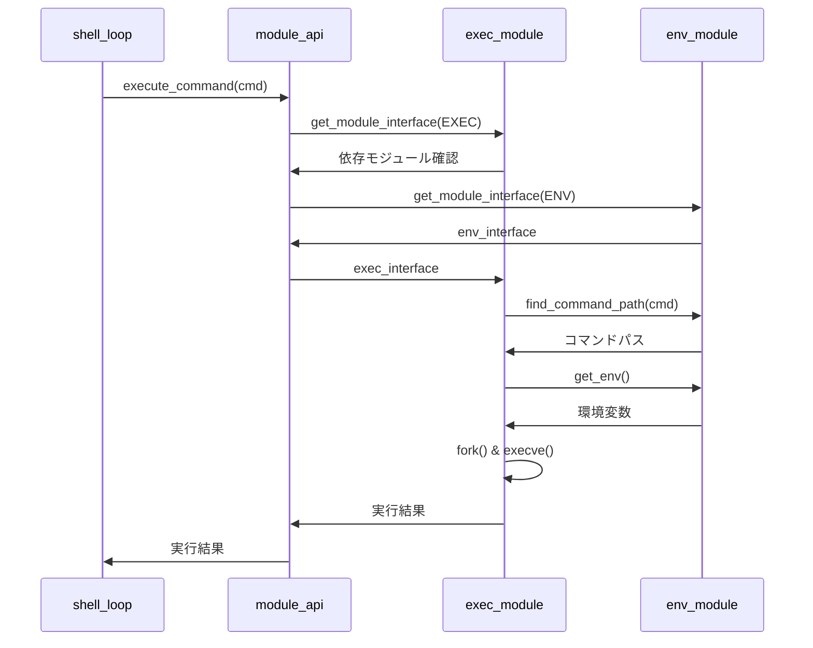
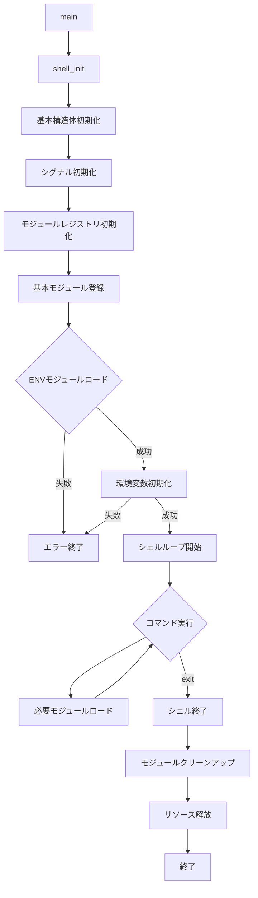

# モジュールシステム詳細設計書

## 1. 概要

このドキュメントでは、モジュラーminishellの中核となる以下のコンポーネントの詳細設計を説明します：

1. **initialize**: シェル環境の初期化
2. **finalize**: シェル環境の終了処理
3. **module_api**: モジュールとコア間のインターフェース
4. **module_loader**: モジュールの読み込みと管理

これらのコンポーネントは42の許容される関数のみを使用して実装されます。

## 2. 設計図

### 全体アーキテクチャ



### 初期化シーケンス



## 3. データ構造

### シェル構造体

```c
typedef struct s_shell
{
    // 基本情報
    char    *source_line;       // 入力行
    int     status;             // 終了ステータス
    int     exit_flag;          // 終了フラグ
    
    // モジュール管理
    t_module_registry *modules; // モジュールレジストリ
    
    // 標準ファイルディスクリプタのバックアップ
    int     stdin_backup;
    int     stdout_backup;
    int     stderr_backup;
    
    // その他の状態
    int     interactive;        // インタラクティブモード
} t_shell;
```

### モジュールレジストリ

```c
typedef struct s_module_registry
{
    t_module    modules[MODULE_COUNT];    // モジュール配列
    int         loaded_count;             // ロード済みモジュール数
} t_module_registry;

typedef struct s_module
{
    t_module_type   type;               // モジュールタイプ
    char            *name;              // モジュール名
    void            *interface;         // モジュールインターフェース
    int             (*init)(t_shell *); // 初期化関数
    int             (*cleanup)(t_shell *); // クリーンアップ関数
    t_module_type   *dependencies;      // 依存モジュール
    int             dep_count;          // 依存モジュール数
    int             loaded;             // ロード状態
} t_module;

typedef enum e_module_type
{
    MODULE_ENV,
    MODULE_EXEC,
    MODULE_REDIRECT,
    MODULE_BUILTIN,
    MODULE_WILDCARD,
    MODULE_COUNT
} t_module_type;
```

## 4. コンポーネント詳細設計

### 4.1 Initialize

#### 機能概要
- シェル環境の初期化
- シグナルハンドラの設定
- モジュールローダーの初期化
- 基本モジュール（特にENV）のロード

#### 主要関数

```c
/**
 * @brief シェル環境を初期化する
 * 
 * @param shell シェル構造体
 * @param env 環境変数
 * @return int 成功時0、失敗時-1
 */
int shell_init(t_shell *shell, char **env)
{
    // シェル構造体の初期化
    ft_memset(shell, 0, sizeof(t_shell));
    shell->status = 0;
    shell->interactive = isatty(STDIN_FILENO);
    
    // 標準ファイルディスクリプタのバックアップ
    shell->stdin_backup = dup(STDIN_FILENO);
    shell->stdout_backup = dup(STDOUT_FILENO);
    shell->stderr_backup = dup(STDERR_FILENO);
    if (shell->stdin_backup == -1 || shell->stdout_backup == -1 || 
        shell->stderr_backup == -1)
        return (ERROR);
    
    // シグナル初期化
    if (init_signals() != 0)
        return (ERROR);
    
    // モジュールローダーの初期化
    shell->modules = (t_module_registry *)malloc(sizeof(t_module_registry));
    if (!shell->modules)
        return (ERROR);
    ft_memset(shell->modules, 0, sizeof(t_module_registry));
    
    // 基本モジュールの登録
    if (register_modules(shell) != 0)
        return (ERROR);
    
    // 必須モジュールのロード（ENV）
    if (load_module(shell, MODULE_ENV) != 0)
        return (ERROR);
    
    // ENV初期化（環境変数の設定）
    t_env_module *env_mod = (t_env_module *)get_module_interface(shell, MODULE_ENV);
    if (!env_mod || env_mod->init_env(shell, env) != 0)
        return (ERROR);
    
    return (SUCCESS);
}

/**
 * @brief 基本モジュールを登録する
 * 
 * @param shell シェル構造体
 * @return int 成功時0、失敗時-1
 */
static int register_modules(t_shell *shell)
{
    // ENVモジュール登録
    if (register_env_module(shell) != 0)
        return (ERROR);
    
    // EXECモジュール登録
    if (register_exec_module(shell) != 0)
        return (ERROR);
    
    // REDIRECTモジュール登録
    if (register_redirect_module(shell) != 0)
        return (ERROR);
    
    // BUILTINモジュール登録
    if (register_builtin_module(shell) != 0)
        return (ERROR);
    
    return (SUCCESS);
}
```

### 4.2 Finalize

#### 機能概要
- シェル環境のクリーンアップ
- モジュールのアンロード
- リソースの解放

#### 主要関数

```c
/**
 * @brief シェル環境を終了する
 * 
 * @param shell シェル構造体
 * @param status 終了ステータス
 */
void shell_exit(t_shell *shell, int status)
{
    // モジュールのクリーンアップ
    if (shell->modules)
    {
        for (int i = 0; i < MODULE_COUNT; i++)
        {
            if (shell->modules->modules[i].loaded && 
                shell->modules->modules[i].cleanup)
                shell->modules->modules[i].cleanup(shell);
        }
        free(shell->modules);
    }
    
    // 入力行の解放
    if (shell->source_line)
        free(shell->source_line);
    
    // 標準ファイルディスクリプタの復元と解放
    if (shell->stdin_backup != -1)
    {
        dup2(shell->stdin_backup, STDIN_FILENO);
        close(shell->stdin_backup);
    }
    if (shell->stdout_backup != -1)
    {
        dup2(shell->stdout_backup, STDOUT_FILENO);
        close(shell->stdout_backup);
    }
    if (shell->stderr_backup != -1)
    {
        dup2(shell->stderr_backup, STDERR_FILENO);
        close(shell->stderr_backup);
    }
    
    // readline履歴のクリア
    rl_clear_history();
    
    exit(status);
}
```

### 4.3 Module API

#### 機能概要
- モジュールとコア間のインターフェース定義
- モジュール機能へのアクセス提供
- モジュール間の依存関係管理

#### モジュールインターフェース

```c
// ENVモジュールインターフェース
typedef struct s_env_module
{
    int     (*init_env)(t_shell *shell, char **env);
    char    **(*get_env)(t_shell *shell);
    char    *(*get_env_value)(t_shell *shell, const char *name);
    int     (*set_env)(t_shell *shell, const char *name, const char *value);
    int     (*unset_env)(t_shell *shell, const char *name);
    char    *(*expand_variables)(t_shell *shell, const char *str);
    char    *(*find_command_path)(t_shell *shell, const char *cmd);
} t_env_module;

// EXECモジュールインターフェース
typedef struct s_exec_module
{
    int     (*execute)(t_shell *shell, t_command *cmd);
    int     (*execute_pipeline)(t_shell *shell, t_pipeline *pipeline);
    int     (*wait_for_processes)(t_shell *shell);
} t_exec_module;

// REDIRECTモジュールインターフェース
typedef struct s_redirect_module
{
    int     (*setup_redirects)(t_shell *shell, t_command *cmd);
    int     (*restore_redirects)(t_shell *shell);
    int     (*handle_heredoc)(t_shell *shell, const char *delimiter);
} t_redirect_module;

// BUILTINモジュールインターフェース
typedef struct s_builtin_module
{
    int     (*is_builtin)(const char *cmd);
    int     (*execute_builtin)(t_shell *shell, t_command *cmd);
} t_builtin_module;
```

#### 主要関数

```c
/**
 * @brief モジュールインターフェースを取得する
 * 
 * @param shell シェル構造体
 * @param type モジュールタイプ
 * @return void* モジュールインターフェース、失敗時NULL
 */
void *get_module_interface(t_shell *shell, t_module_type type)
{
    if (!shell || !shell->modules || type >= MODULE_COUNT)
        return (NULL);
    
    t_module *module = &shell->modules->modules[type];
    if (!module->loaded)
    {
        // 必要に応じてモジュールをロード
        if (load_module(shell, type) != 0)
            return (NULL);
    }
    
    return (module->interface);
}

/**
 * @brief モジュールを登録する
 * 
 * @param shell シェル構造体
 * @param type モジュールタイプ
 * @param name モジュール名
 * @param init 初期化関数
 * @param cleanup クリーンアップ関数
 * @param interface インターフェース
 * @param deps 依存モジュール
 * @param dep_count 依存モジュール数
 * @return int 成功時0、失敗時-1
 */
int register_module(t_shell *shell, t_module_type type, const char *name,
                    int (*init)(t_shell *), int (*cleanup)(t_shell *),
                    void *interface, t_module_type *deps, int dep_count)
{
    if (!shell || !shell->modules || type >= MODULE_COUNT)
        return (ERROR);
    
    t_module *module = &shell->modules->modules[type];
    
    module->type = type;
    module->name = ft_strdup(name);
    if (!module->name)
        return (ERROR);
    
    module->init = init;
    module->cleanup = cleanup;
    module->interface = interface;
    
    // 依存モジュールの設定
    if (dep_count > 0 && deps)
    {
        module->dependencies = (t_module_type *)malloc(sizeof(t_module_type) * dep_count);
        if (!module->dependencies)
        {
            free(module->name);
            return (ERROR);
        }
        ft_memcpy(module->dependencies, deps, sizeof(t_module_type) * dep_count);
        module->dep_count = dep_count;
    }
    
    return (SUCCESS);
}
```

### 4.4 Module Loader

#### 機能概要
- モジュールの動的ロード・アンロード
- モジュール間の依存関係解決
- モジュールの初期化と終了処理

#### 主要関数

```c
/**
 * @brief モジュールをロードする
 * 
 * @param shell シェル構造体
 * @param type ロードするモジュールタイプ
 * @return int 成功時0、失敗時-1
 */
int load_module(t_shell *shell, t_module_type type)
{
    if (!shell || !shell->modules || type >= MODULE_COUNT)
        return (ERROR);
    
    t_module *module = &shell->modules->modules[type];
    
    // 既にロード済みの場合は成功
    if (module->loaded)
        return (SUCCESS);
    
    // 依存モジュールのロード
    for (int i = 0; i < module->dep_count; i++)
    {
        if (load_module(shell, module->dependencies[i]) != 0)
            return (ERROR);
    }
    
    // モジュールの初期化
    if (module->init && module->init(shell) != 0)
        return (ERROR);
    
    module->loaded = 1;
    shell->modules->loaded_count++;
    
    return (SUCCESS);
}

/**
 * @brief モジュールをアンロードする
 * 
 * @param shell シェル構造体
 * @param type アンロードするモジュールタイプ
 * @return int 成功時0、失敗時-1
 */
int unload_module(t_shell *shell, t_module_type type)
{
    if (!shell || !shell->modules || type >= MODULE_COUNT)
        return (ERROR);
    
    t_module *module = &shell->modules->modules[type];
    
    // ロードされていない場合は何もしない
    if (!module->loaded)
        return (SUCCESS);
    
    // 依存関係チェック - このモジュールに依存する他のモジュールがロードされている場合はエラー
    for (int i = 0; i < MODULE_COUNT; i++)
    {
        if (i == type || !shell->modules->modules[i].loaded)
            continue;
        
        for (int j = 0; j < shell->modules->modules[i].dep_count; j++)
        {
            if (shell->modules->modules[i].dependencies[j] == type)
                return (ERROR);  // 依存関係があるためアンロード不可
        }
    }
    
    // モジュールのクリーンアップ
    if (module->cleanup && module->cleanup(shell) != 0)
        return (ERROR);
    
    module->loaded = 0;
    shell->modules->loaded_count--;
    
    return (SUCCESS);
}
```

## 5. モジュール実装例

### 5.1 ENV モジュール

ENVモジュールは最初に読み込まれる必須モジュールで、環境変数の管理を担当します。

```c
// ENVモジュール構造体
typedef struct s_env_data
{
    char    **env_vars;     // 環境変数配列
    int     var_count;      // 環境変数数
} t_env_data;

// ENVモジュールインターフェース実装
static int env_init(t_shell *shell);
static int env_cleanup(t_shell *shell);
static int init_env(t_shell *shell, char **env);
static char **get_env(t_shell *shell);
static char *get_env_value(t_shell *shell, const char *name);
static int set_env(t_shell *shell, const char *name, const char *value);
static int unset_env(t_shell *shell, const char *name);
static char *expand_variables(t_shell *shell, const char *str);
static char *find_command_path(t_shell *shell, const char *cmd);

// ENVモジュールインターフェース
static t_env_module env_interface = {
    .init_env = init_env,
    .get_env = get_env,
    .get_env_value = get_env_value,
    .set_env = set_env,
    .unset_env = unset_env,
    .expand_variables = expand_variables,
    .find_command_path = find_command_path
};

/**
 * @brief ENVモジュールを登録する
 * 
 * @param shell シェル構造体
 * @return int 成功時0、失敗時-1
 */
int register_env_module(t_shell *shell)
{
    // 依存モジュールなし
    return (register_module(shell, MODULE_ENV, "env", env_init, env_cleanup,
                           &env_interface, NULL, 0));
}

/**
 * @brief ENVモジュールを初期化する
 * 
 * @param shell シェル構造体
 * @return int 成功時0、失敗時-1
 */
static int env_init(t_shell *shell)
{
    t_env_data *env_data = (t_env_data *)malloc(sizeof(t_env_data));
    if (!env_data)
        return (ERROR);
    
    ft_memset(env_data, 0, sizeof(t_env_data));
    
    // モジュールデータをシェルに保存
    shell->modules->modules[MODULE_ENV].data = env_data;
    
    return (SUCCESS);
}
```

### 5.2 EXEC モジュール

EXECモジュールはENVモジュールに依存し、コマンドの実行を担当します。

```c
// EXECモジュール構造体
typedef struct s_exec_data
{
    pid_t   *child_pids;    // 子プロセスID配列
    int     pid_count;      // 子プロセス数
    int     last_status;    // 最後の終了ステータス
} t_exec_data;

// EXECモジュールインターフェース実装
static int exec_init(t_shell *shell);
static int exec_cleanup(t_shell *shell);
static int execute(t_shell *shell, t_command *cmd);
static int execute_pipeline(t_shell *shell, t_pipeline *pipeline);
static int wait_for_processes(t_shell *shell);

// EXECモジュールインターフェース
static t_exec_module exec_interface = {
    .execute = execute,
    .execute_pipeline = execute_pipeline,
    .wait_for_processes = wait_for_processes
};

/**
 * @brief EXECモジュールを登録する
 * 
 * @param shell シェル構造体
 * @return int 成功時0、失敗時-1
 */
int register_exec_module(t_shell *shell)
{
    // ENVモジュールに依存
    static t_module_type deps[] = { MODULE_ENV };
    return (register_module(shell, MODULE_EXEC, "exec", exec_init, exec_cleanup,
                           &exec_interface, deps, 1));
}

/**
 * @brief コマンドを実行する
 * 
 * @param shell シェル構造体
 * @param cmd コマンド構造体
 * @return int 成功時0、失敗時-1
 */
static int execute(t_shell *shell, t_command *cmd)
{
    // ENVモジュールのインターフェースを取得
    t_env_module *env_mod = (t_env_module *)get_module_interface(shell, MODULE_ENV);
    if (!env_mod)
        return (ERROR);
    
    // コマンドパスの検索
    char *cmd_path = env_mod->find_command_path(shell, cmd->argv[0]);
    if (!cmd_path)
        return (ERROR);
    
    // 環境変数の取得
    char **env = env_mod->get_env(shell);
    if (!env)
        return (free(cmd_path), ERROR);
    
    // 子プロセス作成と実行
    pid_t pid = fork();
    if (pid == -1)
        return (free(cmd_path), ERROR);
    
    if (pid == 0)
    {
        // 子プロセス
        execve(cmd_path, cmd->argv, env);
        perror("execve");
        exit(EXIT_FAILURE);
    }
    else
    {
        // 親プロセス
        free(cmd_path);
        
        // 子プロセスIDを保存
        t_exec_data *exec_data = shell->modules->modules[MODULE_EXEC].data;
        exec_data->child_pids = ft_realloc(exec_data->child_pids,
                                         sizeof(pid_t) * exec_data->pid_count,
                                         sizeof(pid_t) * (exec_data->pid_count + 1));
        if (!exec_data->child_pids)
            return (ERROR);
        
        exec_data->child_pids[exec_data->pid_count++] = pid;
    }
    
    return (SUCCESS);
}
```

## 6. モジュール間の連携

### ENVモジュールとEXECモジュールの連携



## 7. モジュールフラグ管理

モジュールの有効/無効を制御するフラグ管理システムを実装します。

```c
// モジュールフラグ
#define MODULE_FLAG_ENV      (1 << MODULE_ENV)
#define MODULE_FLAG_EXEC     (1 << MODULE_EXEC)
#define MODULE_FLAG_REDIRECT (1 << MODULE_REDIRECT)
#define MODULE_FLAG_BUILTIN  (1 << MODULE_BUILTIN)
#define MODULE_FLAG_WILDCARD (1 << MODULE_WILDCARD)

// すべてのモジュールを有効化
#define MODULE_FLAG_ALL      (MODULE_FLAG_ENV | MODULE_FLAG_EXEC | \
                             MODULE_FLAG_REDIRECT | MODULE_FLAG_BUILTIN | \
                             MODULE_FLAG_WILDCARD)

// 最小構成（ENVとEXECのみ）
#define MODULE_FLAG_MINIMAL  (MODULE_FLAG_ENV | MODULE_FLAG_EXEC)

/**
 * @brief モジュールを有効化する
 * 
 * @param shell シェル構造体
 * @param flags 有効化するモジュールフラグ
 * @return int 成功時0、失敗時-1
 */
int enable_modules(t_shell *shell, int flags)
{
    for (int i = 0; i < MODULE_COUNT; i++)
    {
        if (flags & (1 << i))
        {
            if (load_module(shell, i) != 0)
                return (ERROR);
        }
    }
    return (SUCCESS);
}

/**
 * @brief モジュールを無効化する
 * 
 * @param shell シェル構造体
 * @param flags 無効化するモジュールフラグ
 * @return int 成功時0、失敗時-1
 */
int disable_modules(t_shell *shell, int flags)
{
    for (int i = 0; i < MODULE_COUNT; i++)
    {
        if (flags & (1 << i))
        {
            if (unload_module(shell, i) != 0)
                return (ERROR);
        }
    }
    return (SUCCESS);
}
```

## 8. 初期化処理フロー



## 9. 結論

この設計により、モジュールの動的ロード・アンロードが可能な軽量minishellを実装できます。特にENVモジュールを最初に読み込み、他のモジュールがそれに依存する構造により、環境変数の一貫した管理が可能になります。また、モジュールフラグによる制御で、必要な機能のみを有効化することができます。

この設計は42の許容される関数のみを使用し、Norm規約に準拠しています。また、将来的にSQLサーバーなどの対話型コントローラに移植可能な柔軟な構造となっています。
