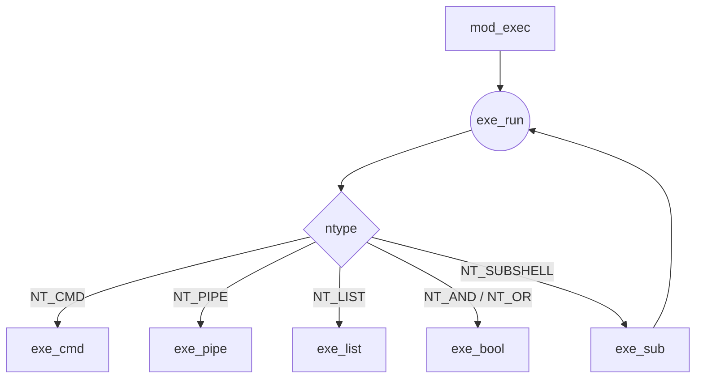

# Minishell Exec モジュール設計書

## 0. このドキュメントについて

- **対象範囲**: `mod_exec` 以降、コマンド実行フェーズに関わるコード全般。
- **読者**: 本リポジトリの実装者・レビュワー・未来の自分。
- **スタイル**: Geek 的こだわり × 英国紳士のたしなみ。多少のユーモアを交えつつ、42 规约に沿った実装ヒントを添付します。

---

## 1. 全体アーキテクチャ



_`exe_run()` が dispatcher となり、各ノード種別に応じて専用ハンドラへ振り分けます。_

---

## 2. 用語 & 構造体早見表

| 記号            | 意味                                                         | 定義場所       |
| --------------- | ------------------------------------------------------------ | -------------- |
| `t_ast`         | 抽象構文木ノード                                             | `inc/ms_ast.h` |
| `t_args`        | `NT_CMD` 専用の付随データ。argv / redir / fds / pid 等を保持 | 同上           |
| `FDBackup`      | _RAII 風_ FD 差し替え補助構造体（本設計で新規追加）          | 本モジュール   |
| `shell->status` | 直近コマンドの終了ステータス (POSIX 互換)                    | `core.h`       |

---

## 3. 関数 API 一覧

| 関数                                               | 概要                                                    | ステータス返却                   |
| -------------------------------------------------- | ------------------------------------------------------- | -------------------------------- |
| `t_status mod_exec(t_shell*)`                      | exec フェーズのエントリポイント。AST が無ければ即戻り。 | `E_NONE` or 致命的システムエラー |
| `int      exe_run(t_ast*, t_shell*)`               | AST を DFS で走査し、子ノードを必要に応じ fork/exec。   | UNIX の終了コード (0–255)        |
| `static int exe_cmd(t_ast*, t_shell*)`             | リダイレクト・ビルトイン判定・外部コマンド起動          | 同上                             |
| `static int exe_pipe(t_ast*, t_shell*)`            | 親プロセスで `pipe(2)` を張り、左右を fork で実行       | 右端 CMD のステータス            |
| `static int exe_bool(t_ast*, t_shell*)`            | `&&`, `\|\|`, `;` を包含。条件に応じ右辺を実行          | 仕様通り                         |
| `static int exe_sub(t_ast*, t_shell*)`             | サブシェル (`( ... )`) を子プロセスで再帰評価           | 子シェルのステータス             |
| `static int builtin_launch(char **argv, t_shell*)` | `echo` などのビルトイン実体呼出し                       | ビルトイン自身が返す             |

> **設計原則**: すべてのハンドラは _自ノードの終了ステータス_ を `int` で返し、親が受け取って `shell->status` へ最終反映。

---

## 4. FD 管理 — RAII 的 `FDBackup`

```c
typedef struct s_fdbackup {
    int saved_fd;
    int target_fd;
}   t_fdbackup;

static void fdbackup_enter(t_fdbackup *bk, int tgt) {
    bk->target_fd = tgt;
    bk->saved_fd  = dup(tgt);
}
static void fdbackup_exit(t_fdbackup *bk) {
    if (bk->saved_fd != -1) {
        dup2(bk->saved_fd, bk->target_fd);
        close(bk->saved_fd);
    }
}
```

- `exe_cmd()` 内で stdin/stdout を差し替える際に使用。例外発生時でもリークせず復旧できる。\*

---

## 5. ノード種別ごとの詳細フロー

### 5.1 NT_CMD

1. **リダイレクト解決**: `args->redr` を走査し必要な FD を open。<br> \* 失敗時 → エラーメッセージ出力・ステータス 1 を返す。
2. **FD 差し替え**: `FDBackup` を用いて `STDIN_FILENO` / `STDOUT_FILENO` を変更。
3. **ビルトイン判定**: `is_builtin()` でチェック。
   - true → 親プロセスで直接 `builtin_launch()` を呼ぶ。
   - false → `fork()` + `execve()`.
4. **子 wait** (外部コマンド時) → ステータス解析。
5. **FD 復旧** & リソース開放。

### 5.2 NT_PIPE

- 親が `pipe()` を生成し左右を _それぞれ fork_。
- 左子: `dup2(pipe_write, STDOUT)` → `exe_run(left)` → `_exit()`
- 右子: `dup2(pipe_read,  STDIN )` → `exe_run(right)` → `_exit()`
- 親: 両端 close → `waitpid()` 双方 → 右子のステータスを返却。

### 5.3 NT_AND / NT_OR / NT_LIST ⇒ `exe_bool()`

- 左枝を評価し終了コードを取得。
- 条件判定後、必要であれば右枝を評価。
- 最後に実行したノードのステータスが戻り値。

### 5.4 NT_SUBSHELL

- `fork()` して子で `exe_run()` を再帰呼出し。
- 親は `waitpid()` → 子の結果をそのまま返す。

### 5.5 handle_redr()

- 資源管理が明確で再利用価値が高い：リダイレクト一覧を解析し FD 設定を準備する処理は exe_cmd() から独立させた方がテストしやすい。

1. args->redr を走査し open()
2. エラー文言出力＋戻り値で通知
3. 成功時は args->fds[0/1] にセット いつ close するか を決め打ち出来る：exe_cmd() が FDBackup で dup2 済み・エラー時即 close、正常時も復旧直後に close。

## 6. シグナル & ジョブ制御

| シグナル  | 親プロセス               | 子プロセス             |
| --------- | ------------------------ | ---------------------- |
| `SIGINT`  | ハンドラでプロンプト復帰 | デフォルト (`SIG_DFL`) |
| `SIGQUIT` | 無視 (`SIG_IGN`)         | デフォルト             |

_`exe_cmd()` 内で `fork` する直前に `sigaction(SIGINT, SIG_DFL, …)` を子に適用。_

> **ジョブ制御** (`setpgid` / `tcsetpgrp`) は拡張項目。まずは無効化で OK。

---

## 7. ヒアドキュメント (TT_HEREDOC)

1. SEM フェーズで `tok->value` に本文を格納済。
2. `exe_cmd()` で `pipe()` を開き本文を書き込む → `dup2(pipe_read, STDIN)`.
3. テンポラリファイル不要。メモリ節約目的で `O_TMPFILE` へ切替え可能。

---

## 8. エラーハンドリング方針

| 障害レベル     | 例                                 | 対応                                       |
| -------------- | ---------------------------------- | ------------------------------------------ |
| **致命的**     | `fork()`/`pipe()` 失敗             | `shell_exit()` でプロセス終了              |
| **実行時**     | コマンド not found, パーミッション | 標準エラーへ文言出力 → `return 127/126` 等 |
| **ユーザ入力** | ambiguous redirect など            | SEM フェーズで検出し `E_SYNTAX` 返却済     |

---

## 9. 拡張余地 & TODO

- [ ] `exec` ビルトインの追加（fork 無しでプロセス置換）。
- [ ] `ulimit` 等シェル固有ビルトイン群。
- [ ] `RLIMIT_NOFILE` 監視と FD リーク self‑test。

---
